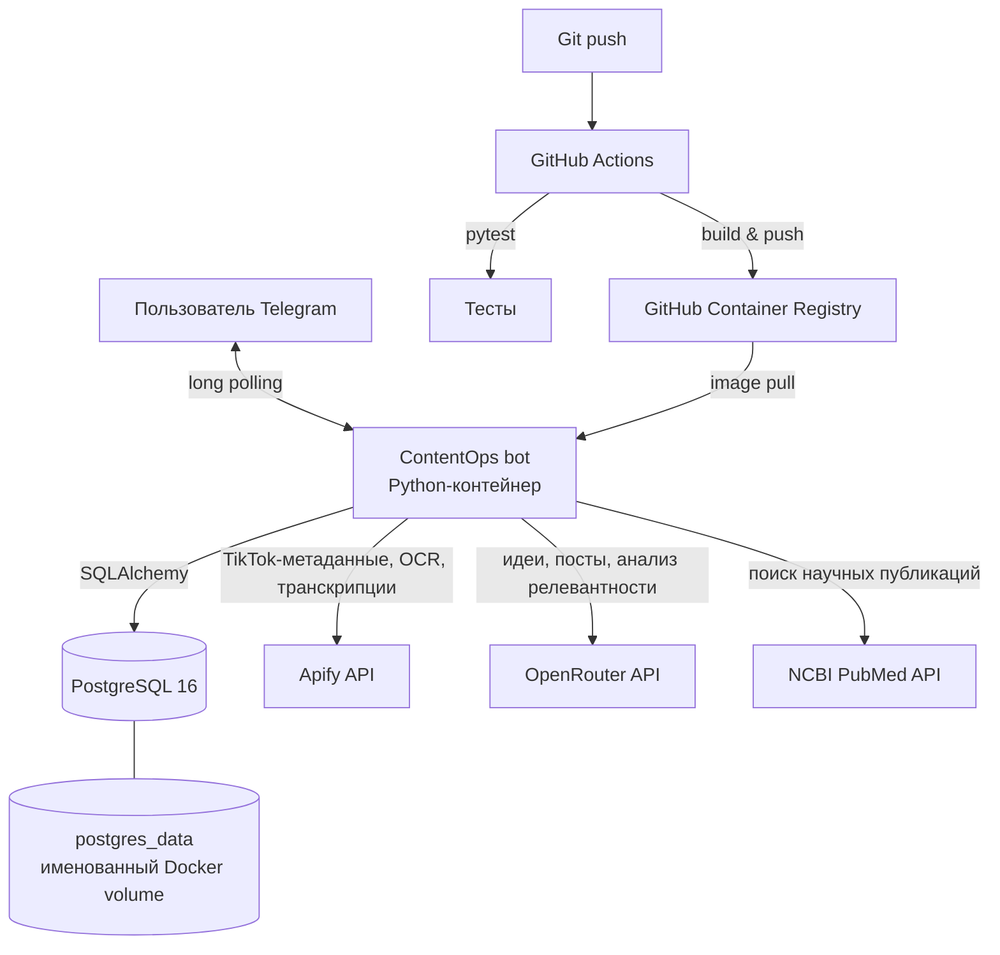

# ContentOps

ContentOps — сервис автоматизации работы с трендовым контентом. Telegram-бот получает запросы пользователя, собирает данные TikTok через Apify, сохраняет и ранжирует контент в PostgreSQL, а затем использует OpenRouter и PubMed API для генерации и проверки черновиков публикаций.

## Архитектура



Архитектура состоит из одного прикладного контейнера и отдельного контейнера базы данных. Взаимодействие между ними происходит внутри сети Docker Compose: приложение обращается к БД по DNS-имени `postgres`, а не по опубликованному порту хоста. Внешние интеграции доступны только через исходящие запросы из контейнера приложения.

## Сервисы

### `bot`

Основной сервис запускается из Docker-образа командой `python -m app.telegram.bot`. Он использует библиотеку `python-telegram-bot` и получает обновления Telegram методом long polling. Поэтому для работы не нужен публичный HTTP-вход, webhook, домен или TLS-терминация: контейнер сам устанавливает исходящее соединение к Telegram API.

При старте бот:

1. Создаёт отсутствующие таблицы в PostgreSQL через SQLAlchemy.
2. Проверяет наличие `TELEGRAM_BOT_TOKEN`.
3. Регистрирует обработчики команд, callback-кнопок и текстовых сообщений.
4. Запускает polling-цикл.

Сервис использует `restart: unless-stopped`. Docker перезапустит его после аварийного завершения или перезагрузки хоста, кроме случая, когда оператор остановил контейнер явно.

### `postgres`

Используется официальный образ `postgres:16`. База хранит:

- собранные элементы контента и рассчитанные оценки тренда;
- настройки пользователей Telegram;
- историю видео, уже использованных для создания постов.

Данные расположены в именованном томе `postgres_data`, смонтированном в `/var/lib/postgresql/data`. Поэтому пересоздание контейнера PostgreSQL не удаляет данные.

У БД настроен healthcheck `pg_isready`. Сервис `bot` содержит зависимость `depends_on` с условием `service_healthy`: запуск бота откладывается, пока PostgreSQL не начнёт принимать подключения. Это исключает типичную race condition, когда приложение стартует раньше БД.

В development-конфигурации порт PostgreSQL опубликован как `5432:5432` для локальной диагностики. В production-конфигурации секция `ports` отсутствует: база доступна только другим контейнерам внутренней сети Compose и не открыта в сеть хоста.

### FastAPI

В пакете присутствует FastAPI-приложение с маршрутами `/`, `/health`, `/hello` и `/config`. Endpoint `/health` возвращает статус `ok` и имя сервиса; он покрыт тестом.

Сейчас Compose запускает Telegram-бота, а не ASGI-сервер. Поэтому FastAPI-интерфейс является отдельным компонентом кода, но не отдельным production-сервисом в текущей схеме развёртывания.

## Поток данных приложения

1. Пользователь выбирает действие в Telegram-боте.
2. Коллекторы запрашивают TikTok-данные через Apify. Для обычного видео извлекается транскрипция; для слайд-шоу — OCR-текст изображений.
3. Нормализатор преобразует ответ внешнего API во внутреннюю модель `ContentItem`.
4. Репозиторий проверяет `external_id`. Если такой элемент уже есть в PostgreSQL, повторная запись не создаётся.
5. Модуль аналитики рассчитывает `trend_score` из просмотров, лайков, комментариев, репостов и возраста публикации.
6. Бот выдаёт ранжированные тренды. При необходимости генератор запрашивает у OpenRouter идею или текст поста.
7. Для фактчекинга модуль research получает публикации из PubMed, анализирует утверждения и может сформировать доработанную версию поста.

## Контейнеризация

`Dockerfile` использует базовый образ `python:3.13.5-slim`, задаёт рабочую директорию `/app`, копирует `requirements.txt` и пакет `app`, устанавливает зависимости и запускает Telegram-бота.

`.dockerignore` исключает из контекста сборки виртуальные окружения, `.env`, кэши, каталоги Git и Python-артефакты. Это уменьшает размер контекста и предотвращает попадание локальных секретов в Docker-образ.

Для стека предусмотрены два Compose-файла:

| Файл | Назначение | Отличия |
| --- | --- | --- |
| `docker-compose.yml` | Локальная разработка | Собирает `bot` из исходников, монтирует каталог проекта и открывает порт PostgreSQL на хосте. Включён Compose watch для пересборки при изменениях. |
| `docker-compose.prod.yml` | Развёртывание | Использует опубликованный образ `ghcr.io/ananevego/contentops:latest`, не монтирует исходный код и не публикует порт базы данных. |

## Конфигурация и секреты

Секреты передаются приложению через файл окружения `.env`, указанный в Compose как `env_file`. Сам файл не отслеживается Git и не передаётся в контекст Docker build.

| Группа переменных | Назначение |
| --- | --- |
| `POSTGRES_DB`, `POSTGRES_USER`, `POSTGRES_PASSWORD` | Инициализация PostgreSQL и строка подключения приложения. |
| `POSTGRES_HOST`, `POSTGRES_PORT` | Адрес БД. В Compose используется `postgres:5432`. |
| `TELEGRAM_BOT_TOKEN` | Аутентификация Telegram-бота. |
| `APIFY_TOKEN` | Доступ к TikTok-коллекторам, транскрипции и OCR. |
| `OPENROUTER_API_KEY` | Генерация идей и постов, LLM-анализ. |
| `NCBI_EMAIL`, `NCBI_API_KEY` | Запросы к PubMed/NCBI для фактчекинга. |
| `APP_NAME`, `ENVIRONMENT` | Метаданные, возвращаемые маршрутом FastAPI `/config`. |

В production секреты должны находиться в защищённом окружении хоста или внешнем менеджере секретов. Они не должны попадать в Dockerfile, Compose-файлы, логи или историю Git.

## CI/CD

GitHub Actions настроен в [`.github/workflows/ci.yml`](.github/workflows/ci.yml). Workflow запускается на каждый `push` и работает в следующей последовательности:

```text
push → checkout → Python 3.13 → pip install → pytest
     → login в ghcr.io через GITHUB_TOKEN
     → Docker build → push образа
```

После успешного `pytest` workflow публикует образ в GitHub Container Registry с двумя тегами:

- `ghcr.io/ananevego/contentops:latest` — последняя успешная сборка;
- `ghcr.io/ananevego/contentops:<SHA коммита>` — неизменяемая версия конкретного коммита.

SHA-тег нужен для воспроизводимого развёртывания и отката: он позволяет запустить строго тот образ, который был собран из определённой версии исходного кода, без зависимости от изменяемого `latest`.

## Проверки

Тесты находятся в каталоге `tests/` и запускаются в CI перед публикацией образа. Они проверяют ответы FastAPI, загрузку конфигурации, модели данных, нормализацию TikTok-данных и требования к редакторскому стилю генератора.
