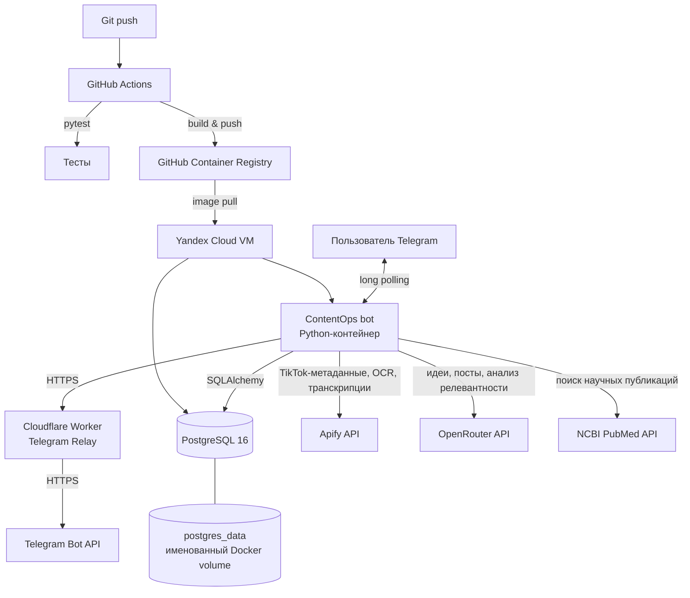

# ContentOps

ContentOps — сервис автоматизации работы с трендовым контентом. Telegram-бот получает запросы пользователя, собирает данные TikTok через Apify, сохраняет и ранжирует контент в PostgreSQL, а затем использует OpenRouter и PubMed API для генерации и проверки черновиков публикаций.

## Архитектура



Архитектура состоит из одного прикладного контейнера и отдельного контейнера базы данных. В production оба контейнера запускаются на виртуальной машине в **Yandex Cloud Compute Cloud** и взаимодействуют внутри сети Docker Compose: приложение обращается к БД по DNS-имени `postgres`, а не по опубликованному порту хоста.

Внешние интеграции доступны через исходящие запросы из контейнера приложения.

Для production-доступа к Telegram Bot API используется Cloudflare Worker как relay. Это связано с тем, что из Yandex Cloud VM прямое TCP-соединение с `api.telegram.org:443` оказалось недоступным, несмотря на наличие рабочего исходящего Интернет-соединения.

В локальной разработке relay не требуется: если переменные `TELEGRAM_RELAY_URL` и `RELAY_SECRET` не заданы, приложение обращается к Telegram Bot API напрямую.

## Production / Yandex Cloud

Production-окружение ContentOps развёрнуто в **Yandex Cloud Compute Cloud**.

Используется виртуальная машина:

* имя: `contentops`;
* ОС: Ubuntu 24.04;
* зона доступности: `ru-central1-b`;
* конфигурация: 2 vCPU, 2 GB RAM;
* boot disk: 20 GB;
* Docker Engine;
* Docker Compose.

На VM не собирается Docker image из исходного кода. Production-конфигурация использует готовый image из GitHub Container Registry:

```text
ghcr.io/ananevego/contentops:latest
```

Таким образом, VM выступает runtime-хостом, а сборка приложения выполняется отдельно в GitHub Actions.

Production deployment имеет следующий поток:

```text
Developer
    │
    │ git push
    ▼
GitHub
    │
    ▼
GitHub Actions
    │
    ├── pytest
    │
    └── Docker build
          │
          ▼
GitHub Container Registry
    │
    │ docker pull
    ▼
Yandex Cloud VM
    │
    └── Docker Compose
          ├── ContentOps bot
          └── PostgreSQL
```

### Yandex Cloud VM и Docker

На VM установлены Docker Engine и Docker Compose plugin.

Production-стек запускается командой:

```bash
docker compose -f docker-compose.prod.yml up -d
```

Production Compose не содержит `build: .`. Вместо этого контейнер приложения запускается из образа, опубликованного CI:

```yaml
image: ghcr.io/ananevego/contentops:latest
```

Это разделяет процессы **build** и **runtime**:

```text
GitHub Actions → build/test/push

Yandex Cloud VM → pull/run
```

PostgreSQL запускается на той же VM отдельным контейнером. Контейнеры находятся в одной Docker Compose network и обращаются друг к другу по имени сервиса.

В production порт PostgreSQL наружу не публикуется. База доступна только внутри Docker-сети.

### Данные PostgreSQL

PostgreSQL использует именованный Docker volume:

```text
postgres_data
```

Volume монтируется в:

```text
/var/lib/postgresql/data
```

Поэтому пересоздание контейнера PostgreSQL не удаляет данные.

На VM `.env` хранится отдельно от Docker image и Git-репозитория. Production-секреты не встраиваются в image.

### Доступ к VM

VM администрируется по SSH.

Публичный IP используется для административного доступа к серверу, но Telegram-бот не использует webhook и не требует публичного HTTP endpoint.

Бот работает через long polling: приложение само устанавливает исходящие соединения для получения обновлений.

В production PostgreSQL не имеет публичного входящего порта.

## Cloudflare Telegram Relay

Для production используется **Cloudflare Worker**:

```text
ContentOps
    │
    │ HTTPS
    │ X-Relay-Secret
    ▼
Cloudflare Worker
    │
    │ HTTPS
    ▼
Telegram Bot API
```

Worker используется как промежуточный relay между Yandex Cloud VM и Telegram Bot API.

Он:

1. принимает HTTP-запрос от ContentOps;
2. проверяет заголовок `X-Relay-Secret`;
3. сравнивает его с секретом `RELAY_SECRET`;
4. при успешной проверке отправляет запрос в `api.telegram.org`;
5. возвращает ответ Telegram приложению.

Прямое соединение:

```text
Yandex Cloud VM → api.telegram.org:443
```

не использовалось в production из-за недоступности TCP-соединения.

Через Worker:

```text
Yandex Cloud VM
       ↓
Cloudflare Worker
       ↓
Telegram Bot API
```

соединение работает.

Relay включается только если одновременно заданы:

```text
TELEGRAM_RELAY_URL
RELAY_SECRET
```

Поэтому один и тот же Docker image поддерживает два режима:

```text
Локально:

ContentOps → Telegram Bot API


Production:

ContentOps → Cloudflare Worker → Telegram Bot API
```

`RELAY_SECRET` хранится:

* в Cloudflare Worker как Secret;
* на production VM в `.env`.

Секрет не хранится в исходном коде, Git или Docker image.

## Сервисы

### `bot`

Основной сервис запускается из Docker-образа командой:

```text
python -m app.telegram.bot
```

Он использует библиотеку `python-telegram-bot` и получает обновления Telegram методом long polling.

При старте бот:

1. Создаёт отсутствующие таблицы в PostgreSQL через SQLAlchemy.
2. Проверяет наличие `TELEGRAM_BOT_TOKEN`.
3. Проверяет production relay-конфигурацию, если она задана.
4. Регистрирует обработчики команд, callback-кнопок и текстовых сообщений.
5. Запускает polling-цикл.

Сервис использует:

```yaml
restart: unless-stopped
```

Docker перезапустит его после аварийного завершения или перезагрузки хоста, кроме случая, когда оператор остановил контейнер явно.

### `postgres`

Используется официальный образ `postgres:16`. База хранит:

* собранные элементы контента и рассчитанные оценки тренда;
* настройки пользователей Telegram;
* историю видео, уже использованных для создания постов.

Данные расположены в именованном томе `postgres_data`, смонтированном в `/var/lib/postgresql/data`. Поэтому пересоздание контейнера PostgreSQL не удаляет данные.

У БД настроен healthcheck `pg_isready`. Сервис `bot` содержит зависимость `depends_on` с условием `service_healthy`: запуск бота откладывается, пока PostgreSQL не начнёт принимать подключения.

В development-конфигурации порт PostgreSQL опубликован как `5432:5432` для локальной диагностики.

В production-конфигурации секция `ports` отсутствует: база доступна только другим контейнерам внутренней сети Compose и не открыта в сеть хоста.

### FastAPI

В пакете присутствует FastAPI-приложение с маршрутами `/`, `/health`, `/hello` и `/config`. Endpoint `/health` возвращает статус `ok` и имя сервиса; он покрыт тестом.

Сейчас Compose запускает Telegram-бота, а не ASGI-сервер. Поэтому FastAPI-интерфейс является отдельным компонентом кода, но не отдельным production-сервисом в текущей схеме развёртывания.

## Поток данных приложения

1. Пользователь выбирает действие в Telegram-боте.
2. Коллекторы запрашивают TikTok-данные через Apify. Для обычного видео извлекается транскрипция; для слайд-шоу — OCR-текст изображений.
3. Нормализатор преобразует ответ внешнего API во внутреннюю модель `ContentItem`.
4. Репозиторий проверяет `external_id`. Если такой элемент уже есть в PostgreSQL, повторная запись не создаётся.
5. Модуль аналитики рассчитывает `trend_score` из просмотров, лайков, комментариев, репостов и возраста публикации.
6. Бот выдаёт ранжированные тренды. При необходимости генератор запрашивает у OpenRouter идею или текст поста.
7. Для фактчекинга модуль research получает публикации из PubMed, анализирует утверждения и может сформировать доработанную версию поста.

## Контейнеризация

`Dockerfile` использует базовый образ `python:3.13.5-slim`, задаёт рабочую директорию `/app`, копирует `requirements.txt` и пакет `app`, устанавливает зависимости и запускает Telegram-бота.

`.dockerignore` исключает из контекста сборки виртуальные окружения, `.env`, кэши, каталоги Git и Python-артефакты. Это уменьшает размер контекста и предотвращает попадание локальных секретов в Docker-образ.

Для стека предусмотрены два Compose-файла:

| Файл                      | Назначение           | Отличия                                                                                                                                                           |
| ------------------------- | -------------------- | ----------------------------------------------------------------------------------------------------------------------------------------------------------------- |
| `docker-compose.yml`      | Локальная разработка | Собирает `bot` из исходников, монтирует каталог проекта и открывает порт PostgreSQL на хосте. Включён Compose watch для пересборки при изменениях.                |
| `docker-compose.prod.yml` | Production           | Использует опубликованный образ `ghcr.io/ananevego/contentops:latest`, не монтирует исходный код и не публикует порт базы данных. Запускается на Yandex Cloud VM. |

## Конфигурация и секреты

Секреты передаются приложению через файл окружения `.env`, указанный в Compose как `env_file`. Сам файл не отслеживается Git и не передаётся в контекст Docker build.

| Группа переменных                                   | Назначение                                                             |
| --------------------------------------------------- | ---------------------------------------------------------------------- |
| `POSTGRES_DB`, `POSTGRES_USER`, `POSTGRES_PASSWORD` | Инициализация PostgreSQL и строка подключения приложения.              |
| `POSTGRES_HOST`, `POSTGRES_PORT`                    | Адрес БД. В production используется `postgres:5432`.                   |
| `TELEGRAM_BOT_TOKEN`                                | Аутентификация Telegram-бота.                                          |
| `TELEGRAM_RELAY_URL`                                | URL Cloudflare Worker relay для production-доступа к Telegram Bot API. |
| `RELAY_SECRET`                                      | Секрет для аутентификации запросов ContentOps к Cloudflare Worker.     |
| `APIFY_TOKEN`                                       | Доступ к TikTok-коллекторам, транскрипции и OCR.                       |
| `OPENROUTER_API_KEY`                                | Генерация идей и постов, LLM-анализ.                                   |
| `NCBI_EMAIL`, `NCBI_API_KEY`                        | Запросы к PubMed/NCBI для фактчекинга.                                 |
| `APP_NAME`, `ENVIRONMENT`                           | Метаданные, возвращаемые маршрутом FastAPI `/config`.                  |

В production секреты находятся на VM в `.env`. Они не попадают в GitHub repository, Dockerfile или Docker image.

## CI/CD

GitHub Actions настроен в [`.github/workflows/ci.yml`](.github/workflows/ci.yml). Workflow запускается на каждый `push` и работает в следующей последовательности:

```text
push → checkout → Python 3.13 → pip install → pytest
     → login в ghcr.io через GITHUB_TOKEN
     → Docker build → push образа
```

После успешного `pytest` workflow публикует образ в GitHub Container Registry с двумя тегами:

* `ghcr.io/ananevego/contentops:latest` — последняя успешная сборка;
* `ghcr.io/ananevego/contentops:<SHA коммита>` — неизменяемая версия конкретного коммита.

SHA-тег нужен для воспроизводимого развёртывания и отката: он позволяет запустить строго тот образ, который был собран из определённой версии исходного кода, без зависимости от изменяемого `latest`.

Production deployment:

```text
git push
   ↓
GitHub Actions
   ↓
pytest
   ↓
Docker build
   ↓
GHCR
   ↓
Yandex Cloud VM
   ↓
docker compose pull
   ↓
docker compose up -d
```

Таким образом, GitHub используется как источник кода и CI/CD-платформа, GHCR — как registry Docker-образов, а Yandex Cloud — как production runtime environment.

## Проверки

Тесты находятся в каталоге `tests/` и запускаются в CI перед публикацией образа. Они проверяют ответы FastAPI, загрузку конфигурации, модели данных, нормализацию TikTok-данных и требования к редакторскому стилю генератора.

Production deployment дополнительно проверяется по состоянию Docker Compose:

```bash
docker compose -f docker-compose.prod.yml ps
```

и логам приложения:

```bash
docker compose -f docker-compose.prod.yml logs --tail=50 bot
```

При включённом production relay приложение выводит:

```text
Telegram relay enabled
Telegram bot started
```

что подтверждает запуск бота с использованием Cloudflare Worker relay.

